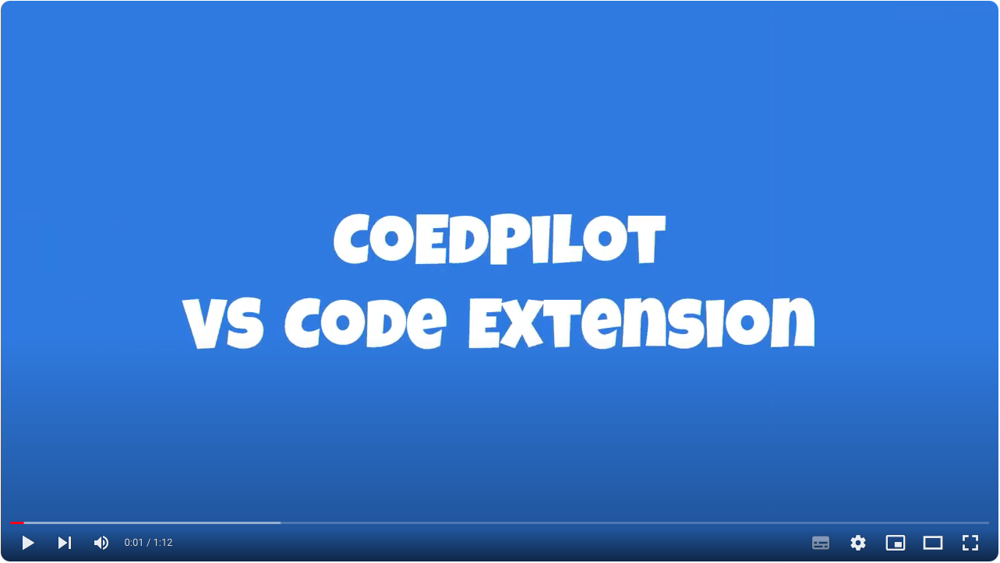

# CoEdPilot: Recommending Code Edits with Learned Prior Edit Relevance, Project-wise Awareness, and Interactive Nature

## Description

This repository contains the training and evaluation code for the paper "*CoEdPilot: Recommending Code Edits with Learned Prior Edit Relevance, Project-wise Awareness, and Interactive Nature*" by Chenyan Liu, Yufan Cai, Yun Lin, Yuhuan Huang, Yunrui Pei, Bo Jiang, Ping Yang, Jin Song Dong, and Hong Mei. Presented at ISSTA'24. 

For proposed VS Code extension, please refer to [CoEdPilot-VSCode](https://github.com/code-philia/CoEdPilot-extension), with detailed deployment instructions.

## 🎥 Demo
> [!NOTE]
> Please click the image to watch the demo video on YouTube.
<div align="center">
   <a href="https://youtu.be/6G2-7Gf0Fhc">
   
   </a>
</div>

## 🔥 Try CoEdPilot Extension
* Please refer to the [CoEdPilot-VSCode](https://github.com/code-philia/CoEdPilot-extension) repository to deploy your own CoEdPilot assistant as VS Code extension.
* All backend models are available in HuggingFace, as detailed in the [CoEdPilot-VSCode](https://github.com/code-philia/CoEdPilot-extension) repository.
* Backend models can be deployed on localhost, remote server and via docker.
* 💬 If you have any questions or feedback, please reach out to us via GitHub Issues.

## 📂 Contents
> More detailed READMEs are available in each subdirectory.

- `/dependency_analyzer`: The inference script and pre-trained model for the dependency analyzer.
- `/file_locator`: The training script for semantic embedding model and the inference script to combine the score of dependency and semantic similarity.
- `/line_locator`: The training and inference script for line-locator.
- `/generator`: The training and inference script for edit-generator.

## 🚀 Getting Started

Our model scripts require **Python 3.10** and **Pytorch with CUDA.**  

Using `pip` (with Python 3.10):

```shell
pip install -r requirements.txt
```

Or using `conda` :

```shell
conda create -n coedpilot python=3.10.13
conda activate coedpilot
python -m pip install -r requirements.txt
```

